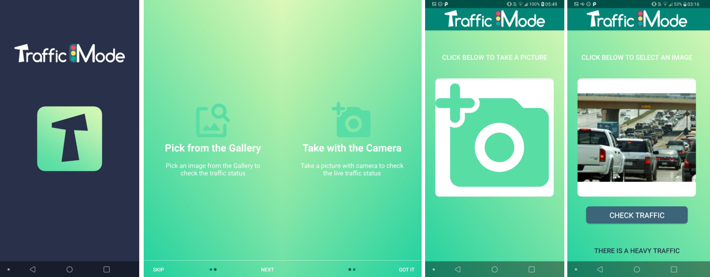

## TrafficMode

[TrafficMode](https://github.com/besteekmen/TrafficApp "app") is a traffic congestion detection application using the PyTorch Android API. It runs the trained model on images selected by the user and classifies as dense traffic, sparse traffic or no traffic. The application was developed on Android Studio 4.4.2 using the Java programming language. The application supports a minimum SDK version of 21 and targets the SDK version of 30. The project is provided with a pre-trained model which could be replaced later.

#### Steps

1. Clone the repository on the local machine.
2. To replace the model, copy the new `model.ptl` file inside `TrafficMode\app\src\main\assets` folder. Keep the name same to avoid confusions.
3. Open the project in Android Studio and let the project build itself.
4. The class labels can be found and edit under `TrafficMode\app\src\main\java\org\pytorch\trafficmode\ModelClasses.java`.
5. Build and run the app on local physical device or on emulator.

#### Results

The main functions of the application are accessing the gallery to pick a picture, taking a picture with camera and accessing it, slider screen for app introduction and using the lite model to perform classification. For each of these tasks, project was built by referring to some tutorials and respective repos for model usage [1], slider screen [2], camera usage [3] and gallery usage [4]. The application demo and screens are given below:

  
  

#### References
[1]	Tang J, [HelloWorldApp](https://github.com/pytorch/android-demo-app/tree/master/HelloWorldApp "app"), (2021) 
[2]	Tamada R, [IntroSlider](https://www.androidhive.info/2016/05/android-build-intro-slider-app "app"), (2017) 
[3]	Olafenwa J, [PytorchMobile](https://github.com/johnolafenwa/PytorchMobile "app"), (2019) 
[4]	Kapoor T C, [Object-Detector-Android-App-Using-PyTorch-Mobile-Neural-Network](https://github.com/tusharck "app"), (2021)